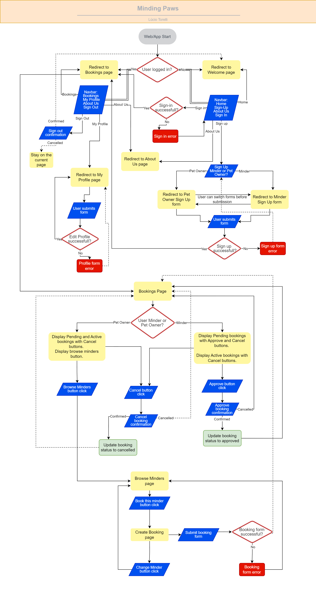
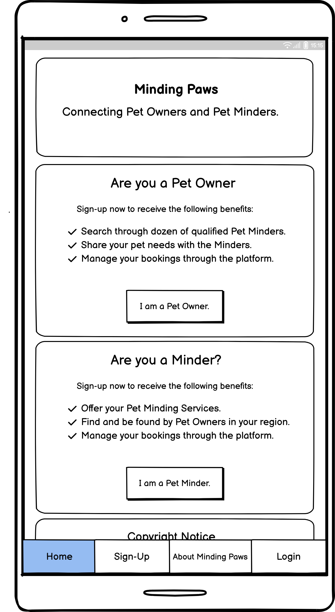
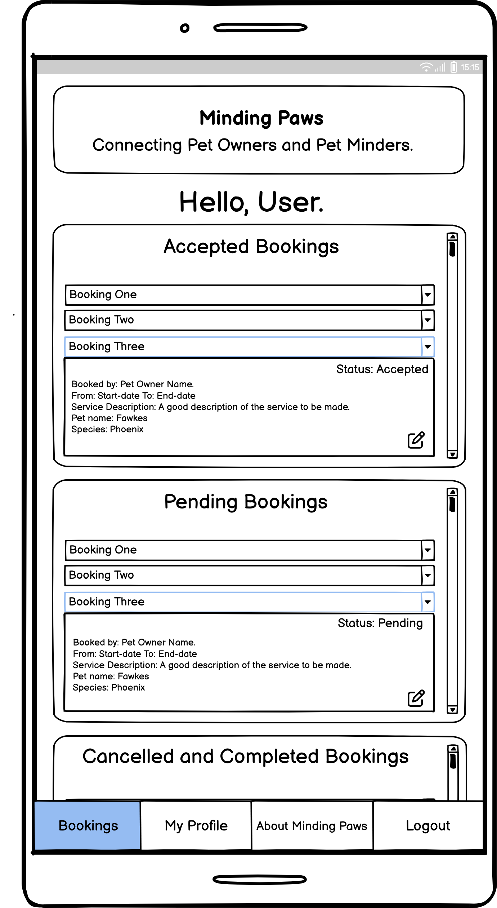
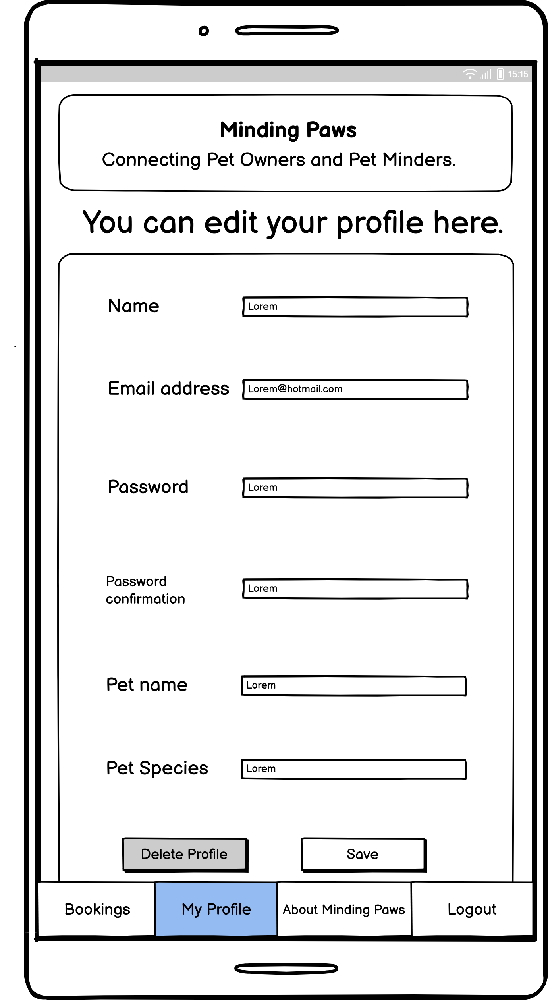
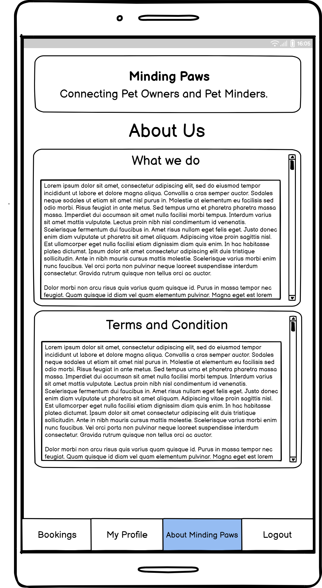
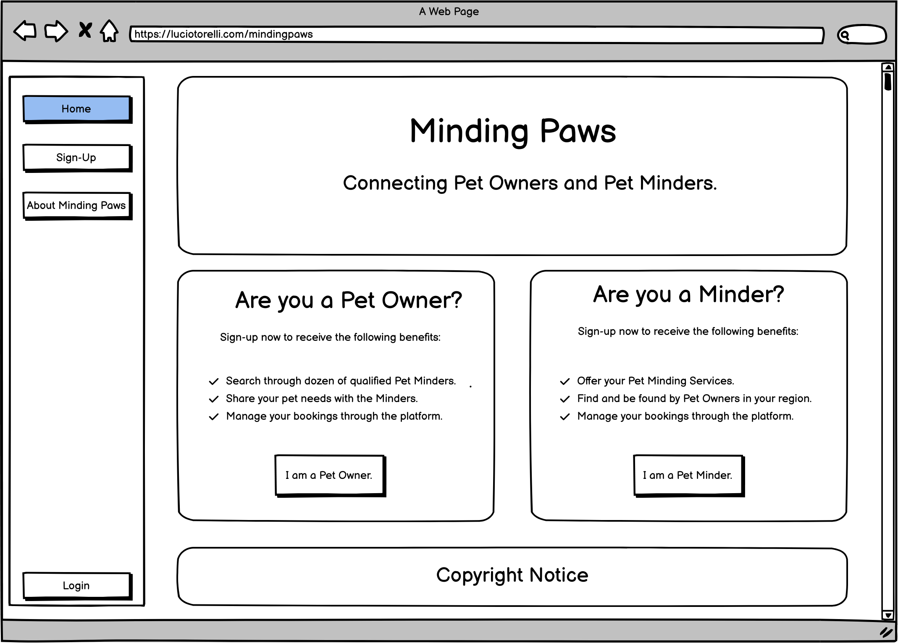
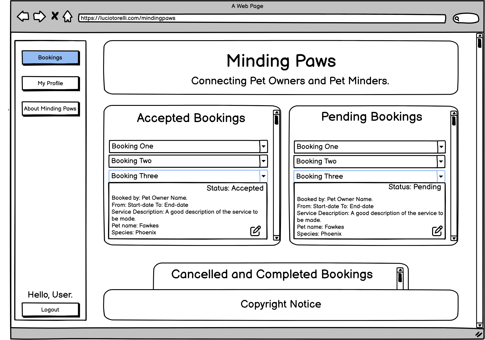
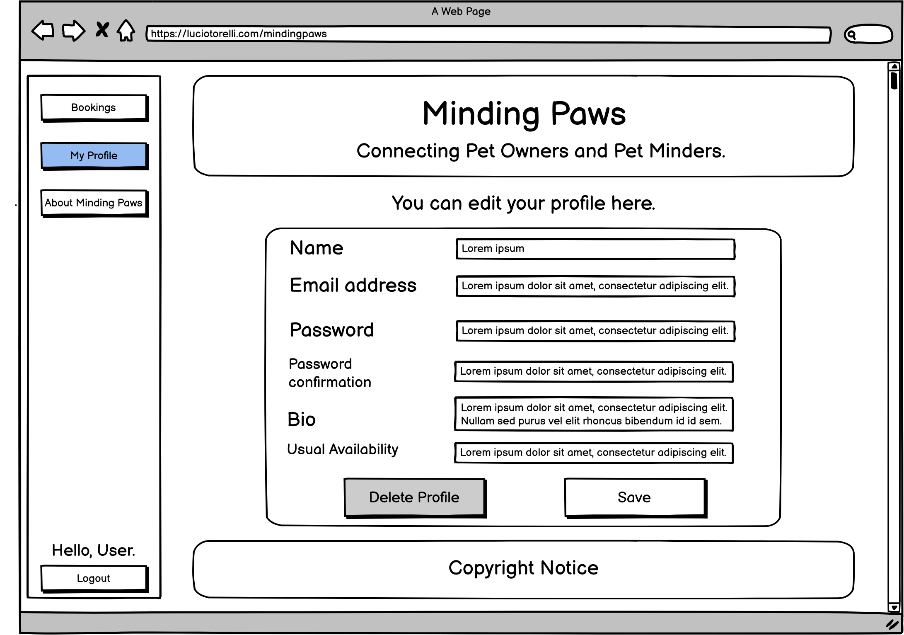
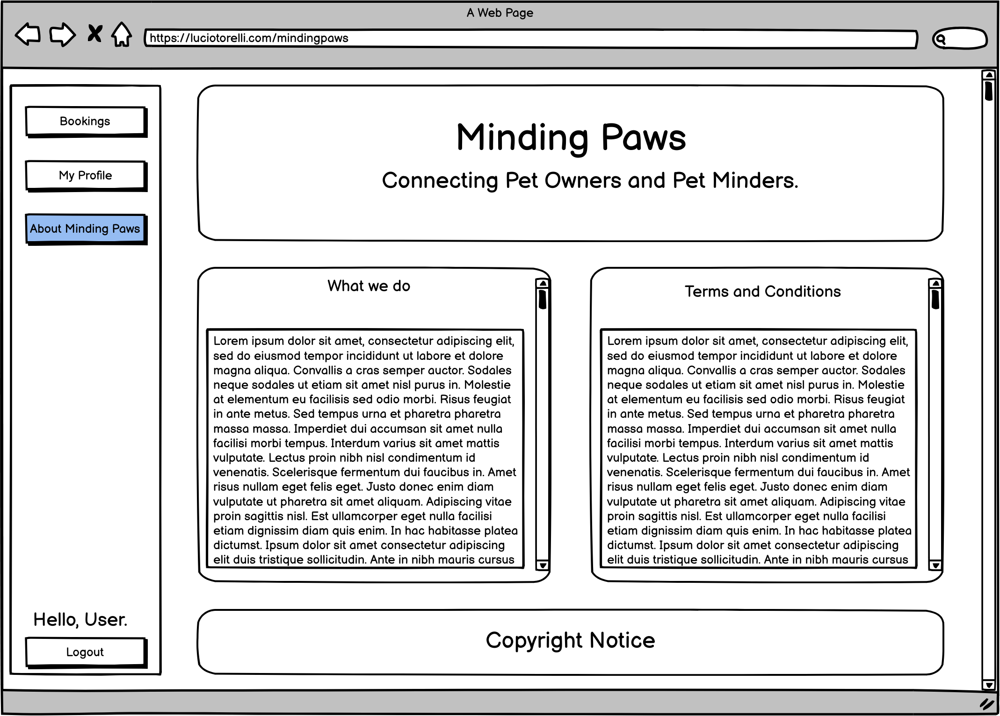

<h2><a href="" target="_blank">Live App here</a></h2>

Minding Paws
---

Minding Paws is a Django application designed to connect pet owners with pet minders. It provides a seamless booking experience for pet owners, while also allowing minders to efficiently manage their service bookings.

## Table of Contents

1.  [Overview](https://github.com/luciotorelli/minding-paws#minding-paws)
2.  [User Stories](https://github.com/luciotorelli/minding-paws#user-stories)
3.  [Project Management and Planning](https://github.com/luciotorelli/minding-paws#project-management-and-planning)
4.  [Data Model](https://github.com/luciotorelli/minding-paws#data-model)
5.  [UX](https://github.com/luciotorelli/minding-paws#UX)
6.  [Features](https://github.com/luciotorelli/minding-paws#features)
    - [Features](https://github.com/luciotorelli/minding-paws#features)
    - [Future Features](https://github.com/luciotorelli/minding-paws#features)
7.  [Technologies used](https://github.com/luciotorelli/minding-paws#technologies-used)
8.  [Testing](https://github.com/luciotorelli/minding-paws#testing)
    - [8.1 Test cases](https://github.com/luciotorelli/minding-paws#test-cases)
    - [8.2 Browser Compatibility](https://github.com/luciotorelli/minding-paws#browser-compatibility)
    - [8.3 Bugs](https://github.com/luciotorelli/minding-paws#bugs)
    - [8.4 Feedback](https://github.com/luciotorelli/minding-paws#feedback)
9.  [Deployment](https://github.com/luciotorelli/minding-paws#deployment)
10. [Credits](https://github.com/luciotorelli/minding-paws#credits)
    - [10.1 Special Thanks!](https://github.com/luciotorelli/minding-paws#special-thanks)
    - [10.2 Resources used](https://github.com/luciotorelli/minding-paws#resources-used)
    - [10.3 Tutorials used](https://github.com/luciotorelli/minding-paws#tutorials-used-no-code-was-copied-and-pasted-only-inspired-or-adapted)
    - [10.4 Imported library](https://github.com/luciotorelli/minding-paws#imported-libraries)

---

## User Stories

### Pet Owner:

- As a Pet Owner, I can easily search and browse through available Minders based on their profile, services, and availability, so that I can find the perfect match for my pet's needs.
- As a Pet Owner, I can securely and conveniently book a pet sitting service with my chosen Minder, specifying the start date, end date and the service description, so that I know when the minder will arrive and leave.
- As a Pet Owner, I can check the status of my booking, if it is accepted, declined, completed or pending, so that I can stay informed about the progress of my booking.
- As a Pet Owner, I can have a friendly interface to manage and review my current and past bookings and edit my profile, so that I can have a place to view all of my booking information and make changes to my profile as needed.

### Minder:

- As a Minder, I can showcase my experience, skills, and availability through my profile, so that Pet Owners can find me and book my services.
- As a Minder, I can receive booking requests from Pet Owners, including all the necessary details about the pet, service duration, and any specific service instruction, so that I understand the requirements of the job.
- As a Minder, I can efficiently manage and organize my bookings, including accepting or declining requests based on my availability, updating the status of active bookings, so that I can ensure that all of my bookings are handled in a timely and efficient manner.
- As a Minder, I can have a friendly interface to edit my profile, so that I can make updates as required.

### Site Owner Goals:

- As the Site Owner, I want to ensure the security and privacy of user information, implementing authentication and data protection measures to safeguard sensitive data, so that users can trust the platform.
- As the Site Owner, I want to have an administrative dashboard to manage user accounts and track bookings, so that I can effectively manage the site and ensure that it is running smoothly.

## Project Management and Planning

### Diagram

### Agile Methodology

This project was idealized following the Agile methodology where the user stories were ordered into sprints based on the importance, timeframe and logic flow. The sprints were them used to create the tasks found within Github built-in project management tool.  

| Sprint | Description                                      |
|--------|--------------------------------------------------|
| Sprint 1 | Project ideation, README, and planning          |
| Sprint 2 | Admin dashboard                                 |
| Sprint 3 | User registration and profile management.           |
| Sprint 4 | Minder listing and booking                      |
| Sprint 5 | Front-end design                                |
| Sprint 6 | Final refinements                               |

### MVC Architecture
This project utilizes the MVC architecture to create a full-stack application. During each sprint those steps were reiterated as required.

1. Model - In this stage, I defined the data models for various entities such as User, Booking, and Minder. I also created the Data Model chart, representing the relationships within the database and updated as seen fit.

2. View - During this stage, I developed interface templates using HTML, CSS, and JavaScript. These templates render data from the models and present it to the users.

3. Controller - In this stage, I implemented the application's logic. The controllers handle user requests, process data from the models, and update the views accordingly.

4. Connect the Model, View, and Controller -
During this stage, I established connections between the models, views, and controllers. The controllers retrieve data from the models, apply updates based on user input, and pass it to the relevant views or files for rendering.

5. Test and Iterate -In this stage, I thoroughly tested the application to ensure its proper functionality. I made adjustments and conducted multiple iterations to enhance overall performance and user experience.

## Data Model

### User Entity

| Key | Name | Type | Notes | Arguments |
|---|---|---|---|---|
| Primary key | id | AutoField | |
|  | name | CharField | | max_length=40, blank=False, null=False |
|  | email | EmailField | |
|  | password | CharField | |
|  | role | CharField | Role choices options: pet-owner, minder or admin | max_length=9, choices=ROLE_CHOICES, blank=False, null=False |
|  | pet_name | CharField | Only required if role equals to Pet Owner | max_length=50, blank=True, null=True |
|  | pet_species | CharField | Only required role equals to Pet Owner | max_length=50, blank=True, null=True |

### Minder Entity

| Key | Name | Type | Notes | Arguments |
|---|---|---|---|---|
| Primary key | id | AutoField | |
| One to One | user_id | User Model | | User, on_delete=models.CASCADE |
|  | bio | TextField | | max_length=500, blank=False, null=False |
|  | usual_availability | CharField | Text description about periods minder is usually available. | max_length=50, help_text="Example: Monday to Friday, 10am to 6pm.", blank=False, null=False |
|  | photo | CloudinaryField | | 'image', default='placeholder' |

### Booking Entity

| Key | Name | Type | Notes | Arguments |
|---|---|---|---|---|
| Primary key | id | AutoField | |
| Foreign Key | minder | Minder Model |  | Minder, on_delete=models.SET_NULL, null=True |
| | pet_owner | User Model |  | User, on_delete=models.SET_NULL, null=True |
| | minder_name | CharField |  | max_length=50, blank=True, null=True, help_text="This field will be prepopulated on save based on the minder selected" |
| | pet_owner_name | CharField |  | max_length=50, blank=True, null=True, help_text="This field will be prepopulated on save based on the pet owner selected | 
|  | start_date | DateTimeField | | blank=False, null=False |
|  | end_date | DateTimeField | | blank=False, null=False |
|  | status | CharField |  | max_length=20, choices=STATUS_CHOICES, blank=False, null=False |
|  | service_description | TextField | | max_length=400, blank=False, null=False |
|  | pet_name | CharField | Preloads from pet_owner but can be edited during booking without updating Pet Owner profile | max_length=50, blank=False, null=False |
|  | pet_species | CharField | Preloads from pet_owner but can be edited during booking without updating Pet Owner profile | max_length=50, blank=False, null=False |

## UX

### Wireframes

   
Mobile

      
-  

         
Homepage

            
      

- 

     
Bookings

        
  

- 

     
My Profile

        
  

- 

     
About Us

        
  

   
Desktop

   
-  

         
Homepage

            
      

- 

     
Bookings

        
  

- 

     
My Profile

        
  

- 

     
About Us

        
  

### Color palette

## Features
 
      

### Future Features
  

---

## Technologies used

---

## Testing

 

### Test Cases

---

 

### Browser Compatibility

 

### Bugs

 

### Feedback

---

 

## Deployment

---

## Credits

### Special Thanks!

### Resources used

### Tutorials used (No code was copied and pasted, only inspired or adapted)

### Imported libraries

  
---