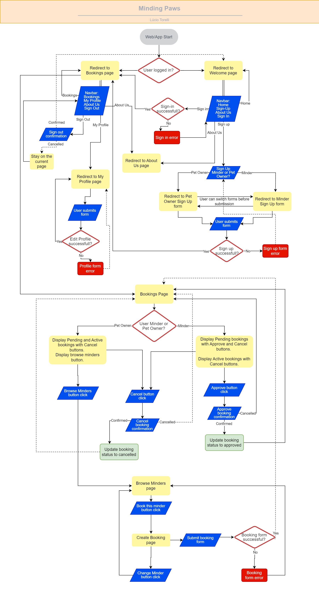
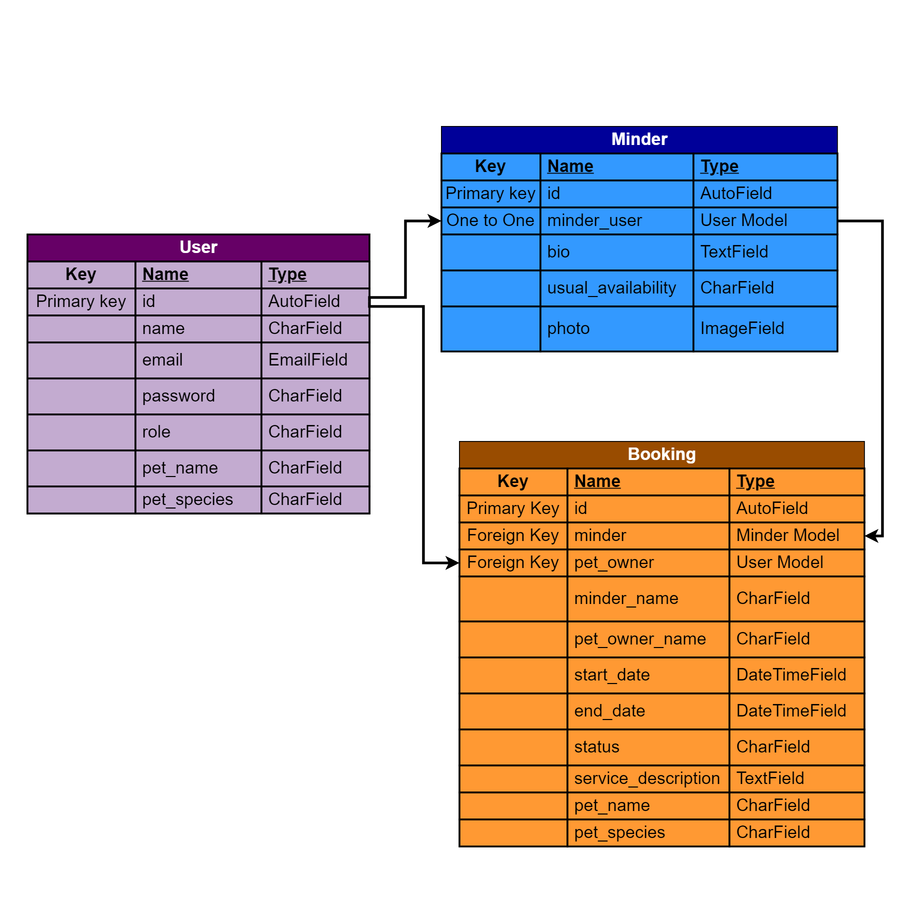
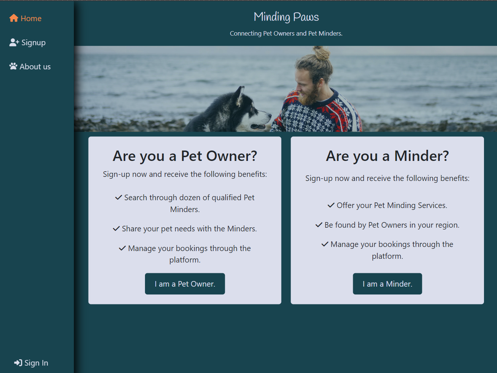

<h2><a href="https://minding-paws-9dfff64ed9cc.herokuapp.com/" target="_blank">Live App here</a></h2>

Minding Paws
---

Minding Paws is a Django application designed to connect pet owners with pet minders. It provides a seamless booking experience for pet owners, while also allowing minders to efficiently manage their service bookings.

## Table of Contents

1. [Overview](https://github.com/luciotorelli/minding-paws#overview)
2. [User Stories](https://github.com/luciotorelli/minding-paws#user-stories)
3. [Project Management and Planning](https://github.com/luciotorelli/minding-paws#project-management-and-planning)
4. [Data Model](https://github.com/luciotorelli/minding-paws#data-model)
5. [UX](https://github.com/luciotorelli/minding-paws#ux)
6. [Features](https://github.com/luciotorelli/minding-paws#features)
    - [6.1 Features](https://github.com/luciotorelli/minding-paws#features-1)
    - [6.2 Future Features](https://github.com/luciotorelli/minding-paws#future-features)
7. [Technologies used](https://github.com/luciotorelli/minding-paws#technologies-used)
8. [Testing](https://github.com/luciotorelli/minding-paws#testing)
    - [8.1 Test Cases](https://github.com/luciotorelli/minding-paws#test-cases)
    - [8.2 Browser Compatibility](https://github.com/luciotorelli/minding-paws#browser-compatibility)
    - [8.3 Bugs](https://github.com/luciotorelli/minding-paws#bugs)
    - [8.4 Feedback](https://github.com/luciotorelli/minding-paws#feedback)
9. [Deployment](https://github.com/luciotorelli/minding-paws#deployment)
10. [Credits](https://github.com/luciotorelli/minding-paws#credits)
    - [10.1 Special Thanks!](https://github.com/luciotorelli/minding-paws#special-thanks)
    - [10.2 Resources Used](https://github.com/luciotorelli/minding-paws#resources-used)
    - [10.3 Tutorials Used](https://github.com/luciotorelli/minding-paws#tutorials-used-no-code-was-copied-and-pasted-only-inspired-or-adapted)
    - [10.4 Imported Libraries](https://github.com/luciotorelli/minding-paws#imported-libraries)

---

## User Stories

### Pet Owner:

- As a Pet Owner, I can easily search and browse through available Minders based on their profile, services, and availability, so that I can find the perfect match for my pet's needs.
- As a Pet Owner, I can securely and conveniently book a pet sitting service with my chosen Minder, specifying the start date, end date and the service description, so that I know when the minder will arrive and leave.
- As a Pet Owner, I can check the status of my booking, if it is accepted, declined, completed or pending, so that I can stay informed about the progress of my booking.
- As a Pet Owner, I can have a friendly interface to manage and review my current and past bookings and edit my profile, so that I can have a place to view all of my booking information and make changes to my profile as needed.

### Minder:

- As a Minder, I can showcase my experience, skills, and availability through my profile, so that Pet Owners can find me and book my services.
- As a Minder, I can receive booking requests from Pet Owners, including all the necessary details about the pet, service duration, and any specific service instruction, so that I understand the requirements of the job.
- As a Minder, I can efficiently manage and organize my bookings, including accepting or declining requests based on my availability, updating the status of active bookings, so that I can ensure that all of my bookings are handled in a timely and efficient manner.
- As a Minder, I can have a friendly interface to edit my profile, so that I can make updates as required.

### Site Owner Goals:

- As the Site Owner, I want to ensure the security and privacy of user information, implementing authentication and data protection measures to safeguard sensitive data, so that users can trust the platform.
- As the Site Owner, I want to have an administrative dashboard to manage user accounts and track bookings, so that I can effectively manage the site and ensure that it is running smoothly.

## Project Management and Planning

### Diagram

### Agile Methodology

This project was idealized following the Agile methodology where the user stories were ordered into sprints based on the importance, timeframe and logic flow. The sprints were them used to create the tasks found within Github built-in project management tool.  

| Sprint | Description                                      |
|--------|--------------------------------------------------|
| Sprint 1 | Project ideation, README, and planning          |
| Sprint 2 | Admin dashboard                                 |
| Sprint 3 | User registration and profile management.           |
| Sprint 4 | Minder listing and booking                      |
| Sprint 5 | Front-end design                                |
| Sprint 6 | Final refinements                               |

### MVC Architecture
This project utilizes the MVC architecture to create a full-stack application. During each sprint those steps were reiterated as required.

1. Model - In this stage, I defined the data models for various entities such as User, Booking, and Minder. I also created the Data Model chart, representing the relationships within the database and updated as seen fit.

2. View - During this stage, I developed interface templates using HTML, CSS, and JavaScript. These templates render data from the models and present it to the users.

3. Controller - In this stage, I implemented the application's logic. The controllers handle user requests, process data from the models, and update the views accordingly.

4. Connect the Model, View, and Controller -
During this stage, I established connections between the models, views, and controllers. The controllers retrieve data from the models, apply updates based on user input, and pass it to the relevant views or files for rendering.

5. Test and Iterate -In this stage, I thoroughly tested the application to ensure its proper functionality. I made adjustments and conducted multiple iterations to enhance overall performance and user experience.

## Data Model

## User Entity

| Key | Name | Type | Notes | Arguments |
|---|---|---|---|---|
| Primary key | id | AutoField | |
|  | name | CharField | | max_length=40, blank=False, null=False |
|  | email | EmailField | | blank=True, null=True
|  | password | CharField | | blank=False, null=False
|  | role | CharField | Role choices options: pet-owner, minder, or admin | max_length=9, choices=ROLE_CHOICES, blank=False, null=False |
|  | pet_name | CharField | Only required if role equals to Pet Owner | max_length=50, blank=True, null=True |
|  | pet_species | CharField | Only required if role equals to Pet Owner | max_length=50, blank=True, null=True |

## Minder Entity

| Key | Name | Type | Notes | Arguments |
|---|---|---|---|---|
| Primary key | id | AutoField | |
| One to One | user | User Model | | on_delete=models.CASCADE |
|  | bio | TextField | | max_length=500, blank=False, null=False |
|  | usual_availability | CharField | Text description about periods the minder is usually available. | max_length=50, help_text="Example: Monday to Friday, 10am to 6pm.", blank=False, null=False |
|  | photo | CloudinaryField | | 'image', default='placeholder', null=True, blank=True |

## Booking Entity

| Key | Name | Type | Notes | Arguments |
|---|---|---|---|---|
| Primary key | id | AutoField | |
| Foreign Key | minder | Minder Model |  | on_delete=models.SET_NULL, null=True |
| | pet_owner | User Model |  | on_delete=models.SET_NULL, null=True |
| | minder_name | CharField | Prepopulated based on the minder selected | max_length=50, blank=True, null=True, help_text="This field will be prepopulated on save based on the minder selected" |
| | pet_owner_name | CharField | Prepopulated based on the pet owner selected | max_length=50, blank=True, null=True, help_text="This field will be prepopulated on save based on the pet owner selected" |
|  | start_date | DateTimeField | | blank=False, null=False |
|  | end_date | DateTimeField | | blank=False, null=False |
|  | status | CharField | | max_length=20, choices=STATUS_CHOICES, blank=False, null=False |
|  | service_description | TextField | | max_length=400, blank=False, null=False |
|  | pet_name | CharField | Can be edited during booking without updating Pet Owner profile | max_length=50, blank=False, null=False |
|  | pet_species | CharField | Can be edited during booking without updating Pet Owner profile | max_length=50, blank=False, null=False |

## UX

### Wireframes

   
Mobile

      
-  

         
Homepage

            
      

- 

     
Bookings

        
  

- 

     
My Profile

        
  

- 

     
About Us

        
  

   
Desktop

   
-  

         
Homepage

            
      

- 

     
Bookings

        
  

- 

     
My Profile

        
  

- 

     
About Us

        
  

### Color palette

| Color Code | Usage                                   |
|------------|-----------------------------------------|
| 419CA5     | Certain interactive elements, emphasis. |
| 0D444E     | Primary Buttons, body, active navbar, sections. |
| DBDEEB     | Text, form elements, even rows, content area. |
| ff8952     | Secondary Buttons, interaction.    |
| 171717     | Text, forms, sections.                  |

### Font

The "Handlee" Google Font was selected for its handwritten and playful appearance, adding a personal and friendly touch to platform logo.

## Features
 
    1. In a first logged-out access the user is brought to the landing page where the purpose of the site is clear. The UI is easy to navigate and simple.
    
    2. During sign-up the user can decide if they are a Pet Owner or a Pet Minder. The form is updated to match the requirements of each user role.
    
    3. Once the user is sucessfully signed-in or logged-in, they will see a toast message and be redirected to their bookings page. The toast message are present in other parts of the project to display changes in the database or authentication.
    
    4. On the bookings page accordion, the user is able to edit, cancel, approve or delete bookings based on their role and booking statuses.
    New bookings are automatically created as pending.  Pending bookings can be cancelled by pet owners or minders. If the Minder approves a pending booking, it is set to accepted. Accepted bookings that have end date earlier than the user current time is automatically marked as completed. Completed bookings can be permanently deleted. 
    
    5. When the user performs an action that changes their authentication status or update the database, they will see a modal to confirm or cancel the action.
    
    6. Pet Owner users are able to click on the Book a Minder! button to browse and search all available minders on the platform.
    
    7. Once a Minder is selected, the user is able to complete and submit the form or return to select another minder. To stop multiple calls to the database, the selected Minder is stored on a Session Storage, then retrieved only when the form is submitted.
    
    8. On the My Profile page the user is able to update their details and change their password.
    
    9. The forms changes based on the user role logged in to display the correct fields. For example Minders will see a Photo, Bio and Usual availability fields on the my profile page.
    
    10. The forms are validated at Template level but also in the forms.py, views.py and models.py. Once an invalid input is added to the form, it will be clearly displayed to the user the reason.
    
    11. The about us page display information about the platform and it's services.
    
    12. Django admin has been customized to display, filter and search for fields based on the requirements of this project.
    
    13. The User is able to identify if they are logged-in or out based on the navbar options and the welcome message displayed under the hero image.
    

### Future Features
#### Some features were considered for implementation of this project. However, due to the time constrains and importance those were added to future features instead.
 
 1. <a href="https://github.com/luciotorelli/minding-paws/issues/10">Django Jet was considered to improve the Admin UI.</a>
 
 2. <a href="https://github.com/luciotorelli/minding-paws/issues/15">Storing pet names and species on an array or object to be selected by Pet Owner at booking creation. </a>
 
 3. <a href="https://github.com/luciotorelli/minding-paws/issues/15">Separate Models for: Pets, PetOwner and Minder Services </a>
 
 4. <a href="https://github.com/luciotorelli/minding-paws/issues/9">Dynamically hide/show pet_name and pet_species on Django admin edit user page based on User role to stop admins from adding those fields to minders</a>
 
 5. <a href="https://github.com/luciotorelli/minding-paws/issues/18">Preview of image being uploaded during Minder sign-up</a>
 
 6. Allow minders to select timeslots of availability.
 
 7. Allow minders to set availability for new bookings or new clients.
 
 8. A messaging system to allow minders and pet owners to communicate through the platform.

---

## Technologies used

- [HTML](https://en.wikipedia.org/wiki/HTML) used for the main template contents.
- [CSS](https://en.wikipedia.org/wiki/CSS) used for the styling, design and layout.
- [Bootstrap](https://getbootstrap.com) used as the front-end CSS framework for responsiveness and pre-built components.
- [JavaScript](https://www.javascript.com) used to dynamically display searchs on the front-end, to save information to Session Storage and to replace html content on the dom.
- [Python](https://en.wikipedia.org/wiki/Python_(programming_language)) - Python is a high-level, general-purpose language, used to code django files.
- [Gitpod](https://www.gitpod.io/about) - Gitpod is an open source developer platform automating the provisioning of ready-to-code developer environments. Used to create the tests due to limitation of local development.
- [Heroku](https://dashboard.heroku.com/) - Heroku is a cloud platform as a service supporting several programming languages, used to host the live application.
- [Github and Git](https://docs.github.com/en/get-started/using-git/about-git) - Used to host the development of the project and version control using Git.
- [Django](https://www.djangoproject.com) - used as the Python framework for the site.
- [PostgreSQL](https://www.postgresql.org) - used as the relational database management.
- [ElephantSQL](https://www.elephantsql.com) - used as the database host.
- [Cloudinary](https://cloudinary.com) - used for hosting and serving static files.

---

## Testing

### Test Cases
| Case | Screenshot    | Achieved |
| :---:   | :---: | :---: |
| As a Pet Owner, I can easily search and browse through available Minders based on their profile, services, and availability, so that I can find the perfect match for my pet's needs. |    | Yes   |
| As a Pet Owner, I can securely and conveniently book a pet sitting service with my chosen Minder, specifying the start date, end date and the service description, so that I know when the minder will arrive and leave. |    | Yes   |
| As a Pet Owner, I can check the status of my booking, if it is accepted, declined, completed or pending, so that I can stay informed about the progress of my booking. |    | Yes   |
| As a Pet Owner, I can have a friendly interface to manage and review my current and past bookings and edit my profile, so that I can have a place to view all of my booking information and make changes to my profile as needed. |    | Yes   |
| As a Minder, I can showcase my experience, skills, and availability through my profile, so that Pet Owners can find me and book my services. |    | Yes   |
| As a Minder, I can receive booking requests from Pet Owners, including all the necessary details about the pet, service duration, and any specific service instruction, so that I understand the requirements of the job. |    | Yes   |
| As a Minder, I can efficiently manage and organize my bookings, including accepting or declining requests based on my availability, updating the status of active bookings, so that I can ensure that all of my bookings are handled in a timely and efficient manner. |    | Yes   |
| As a Minder, I can have a friendly interface to edit my profile, so that I can make updates as required. |    | Yes   |
| As a Minder, I can have a friendly interface to edit my profile, so that I can make updates as required. |    | Yes   |
| As the Site Owner, I want to ensure the security and privacy of user information, implementing authentication and data protection measures to safeguard sensitive data, so that users can trust the platform. |    | Yes   |
| As the Site Owner, I want to have an administrative dashboard to manage user accounts and track bookings, so that I can effectively manage the site and ensure that it is running smoothly. |    | Yes   |
---

### Browser Compatibility
#### The app was manually tested on the following browsers. All forms, buttons, views, templates, scripts and functions worked as expected. Database updates are consistent for all browsers.

| Browser | Compatible    | Notes | Version Tested |
| :---:   | :---: | :---: | :---: |
| Chrome Desktop | Yes  | N/A   | 116.0.5845.82   |
| Opera Desktop | Yes  | N/A   | 102.0.4871.0   |
| Edge Desktop | Yes  | N/A   | 	115.0.1901.203   |
| Firefox Desktop | Yes  | N/A   | 116.0.2   |
| Chrome Mobile | Yes  | Scroll bar and datetime picker are displayed differently |  116.0.5845.78  |
| Safari Desktop or Mobile | Yes  | Scroll bar and datetime picker are displayed differently | 16.5 |

### Automated Testing

The code was fully passed for the automated tests created for Python and JavaScript. 

### Issues

Issues were logged using GitHub native issue tracking system. All logged issues can be [viewed here.](https://github.com/luciotorelli/minding-paws/issues)
They were tagged as either bug, enhancement, documentation or user stories accordingly. 

### Feedback

| Feedback | Implemented/Fixed  | Notes |
| :---:   | :---: | :---: |
| No confirmation message when forms are submitted successfully | Yes  | Toastr was used to implement this  |
| Apart from navbar button updates, no confirmation user is currently logged in | Yes  | Welcome message displayed under hero image on every page and toast message added. |
| Order of create booking buttons are confusing on mobile, made me click on "select another minder" by mistake | Yes  | The order is now changed based on mobile views |
| Option to add more than one pet per pet owner | No  | Added to future features |
| Separate pets and minder services into their own models | No  | Added to future features |
| Buttons are inconsistent across app | Yes  | Two custom button styles were created and applied to all buttons. Hover effect is also consistent apart from sign-up page as pill-shaped buttons are intentionally used|
| Desktop navbarbar most commonly placed top or left.   | Yes  | The navbar for mobile is displayed on the bottom and on desktop to the left |
| Display all bookings in one single page   | Yes  | The booking page was divided into 4 sections to display all bookings of the current logged in user.  |
| Unable to select certain minders  | Partially fixed  | See [issue 24](https://github.com/luciotorelli/minding-paws/issues/24) for more details  |

### CRUD (Create, read, update and delete)
#### During automated and manual tests, the following data manipulation permission through front-end (not including admin) was confirmed working as expected.

| Create | Read  | Update | Delete |
| :---:   | :---: | :---: | :---: |
| Booking | Booking  | Booking  | Booking |
| My Profile - User | My Profile - User  | My Profile - User  | X |
| Minder | Minder  | Minder  | X |

### Validation

<li>The code for all Python files (aside from settings.py) was tested against <a href="https://pep8ci.herokuapp.com">provided CI Python Linter</a></li>
<li>The code for all HTML files was tested against <a href="https://validator.w3.org/">W3C Markup validation service.</a></li>
<li>The code for the CSS file was tested against <a href="https://jigsaw.w3.org/css-validator/">W3C CSS validation service.</a></li>
<li>The code for the JavaScript file was tested against <a href="https://jshint.com/">JShint</a></li>   
 
No errors were displayed at final deployment.

### Lighthouse

Google chrome built lighthouse was used to test all pages that returned an acceptable average score of 92 for all categories.

---
 

### Deployment

1. **Database Setup**: Begin by configuring the database. If you're using PostgreSQL, you can set up a PostgreSQL database using [ElephantSQL](https://www.elephantsql.com). Follow these steps:
   - Sign up for an account on ElephantSQL.
   - Create a new instance with a unique name, like your project name.
   - Choose the Tiny Turtle (Free) plan.
   - Select the region and data center closest to you.
   - Once created, note down the database URL and password.

2. **Cloudinary API Integration**: To store media assets online, integrate the [Cloudinary API](https://cloudinary.com) into your application:
   - Create a Cloudinary account.
   - On your Cloudinary Dashboard, obtain your API Environment Variable.
   - Copy the API key, removing `CLOUDINARY_URL=` to leave only the key.
   - Add to your environment variable "DATABASE_URL"

3. **Deploying on Heroku**:
   - Sign up for a Heroku account if you haven't already.
   - Create a new app from your Heroku Dashboard.
   - Access your app's settings and set up environment variables:
      - CLOUDINARY_URL: Paste your Cloudinary API key.
      - DATABASE_URL: Use the ElephantSQL database URL.
      - SECRET_KEY: Choose any random secret key.
      - DEBUG VALUE: Choose True or False.
   - Ensure you have the following files in your project:
      - requirements.txt: List your project's requirements.
      - Procfile: Create this file with the content web: gunicorn app_name.wsgi.
   - Connect your GitHub repository to your Heroku app.
   - Choose automatic deployment from Heroku or manually push your code.

* **Local Deployment for Testing**:
   - Clone or fork the project repository to your local machine.
   - Install project requirements using `pip3 install -r requirements.txt`.
   - Create an env.py file at the root level, adding environment variables stated on step 3 for local testing and set DEBUG to True.
   - Run the Django app: `python3 manage.py runserver`.
   - Perform migrations: `python3 manage.py makemigrations`, then `python3 manage.py migrate`.
   - Create a superuser for local testing: `python3 manage.py createsuperuser`.

* In case you would like to fork, Click the "Fork" button at the top right of the repository's page. This creates a copy of the repository under your GitHub account and then you can follow the steps above for local or heroku deployment.

---

## Credits

### Special Thanks!

- Can - Code Institutor Mentor - I am very grateful for the guidance provided by Can for my project.
- My colleague group - Thanks for testing my project on multiple devices and providing feedback during development.
- My family and friends that were kind enough to test the terminal app on their devices and provide me with feedback and screenshots.
- My study group for sharing the struggles/challenges and keeping each other progressing! ([@alexiiasantos](https://github.com/alexiiasantos), Bohdan, [@GaryS007](https://github.com/GaryS007), [@oconnorian3](https://github.com/oconnorian3), [@James-Fitz](https://github.com/James-Fitz), [@zemaciel](https://github.com/zemaciel), Thomas and Yanina).

### Resources used

- [Code Institute Full Stack - Course material, slack, mentoring and tutoring.](https://codeinstitute.net/ie/full-stack-software-development-diploma/)
- [Stackoverflow - Having the answers to many of my questions.](https://stackoverflow.com/)
- [Notion - Used to take notes of bugs, resources and tutorials prior to uploading them to README](https://www.notion.so/)
- [draw.io (diagrams) - Used to draw the chart of the project.](https://app.diagrams.net/)
- [CI Python Linter - Used to check all Python files against pep8.](https://pep8ci.herokuapp.com/#)
- [CSS Validator - W3C](https://jigsaw.w3.org/css-validator/)
- [JSHint - JavaScript Code Quality Tool](https://jshint.com/)
- [VScode - Used to write the code for this project.](https://code.visualstudio.com/)
- [Gitpod - Used to share a virtual environment with tutors.](https://gitpod.io/workspaces)
- [AutoDocString VS code extension](https://marketplace.visualstudio.com/items?itemName=njpwerner.autodocstring)
- [Google Python Style Guide](https://google.github.io/styleguide/pyguide.html)
- [Django Models Documentation](https://docs.djangoproject.com/en/4.2/ref/models/fields/)
- [Django Auth - AbstractUser](https://docs.djangoproject.com/en/4.2/topics/auth/customizing/)
- [Adding extra field in admin for custom user in Django 1.11](https://stackoverflow.com/questions/50583113/adding-extra-field-in-admin-for-custom-user-in-django-1-11)
- [Displaying ForeignKey fields in Django Admin](https://books.agiliq.com/projects/django-admin-cookbook/en/latest/fk_display.html)
- [Search Fields in Django Admin](https://docs.djangoproject.com/en/3.2/ref/contrib/admin/#django.contrib.admin.ModelAdmin.search_fields)
- [List Display in Django Admin](https://docs.djangoproject.com/en/3.2/ref/contrib/admin/#django.contrib.admin.ModelAdmin.list_display)
- [User's get_full_name method in Django](https://docs.djangoproject.com/en/4.2/ref/contrib/auth/#django.contrib.auth.models.User.get_full_name)
- [Readonly Fields in Django Admin](https://docs.djangoproject.com/en/4.2/ref/contrib/admin/#django.contrib.admin.ModelAdmin.readonly_fields)
- [Reordering fields in Django Admin](https://docs.djangoproject.com/en/4.2/ref/contrib/admin/#django.contrib.admin.ModelAdmin.fieldsets)
- [Difference between fieldset and add_fieldset in UserAdmin](https://stackoverflow.com/questions/50436596/what-is-add-fieldsets-for-in-useradmin-in-django)
- [Positioning the hamburger menu in mobile websites](https://ux.stackexchange.com/questions/101595/mobile-website-menu-should-hamburger-menu-be-on-left-or-the-right)
- [Lorem Ipsum generator](https://loremipsum.io/)
- [Adding spacing between columns](https://stackoverflow.com/a/37566310)
- [Using JS local storage data in Django views](https://stackoverflow.com/questions/52327176/how-do-i-access-data-from-local-storage-in-django-views)
- [Converting Font Awesome icons to favicon](https://gauger.io/fonticon/)
 - [YouTube Music - Used to listen to hours of lofi song during the project development.](https://music.youtube.com/)

### Tutorials used (No code was copied and pasted, only inspired or adapted)
  - [As you type search AJAX Search](https://openfolder.sh/django-tutorial-as-you-type-search-with-ajax)

### Imported templates/libraries

- [toastr](https://codeseven.github.io/toastr/): Provides simple and attractive JavaScript toast notifications for your web application.
- [cloudinary](https://pypi.org/project/cloudinary/): Simplifies image and video management, providing tools for uploading, storing, optimizing, and delivering media files.
- [dj3-cloudinary-storage](https://pypi.org/project/dj3-cloudinary-storage/): Integrates Cloudinary storage with Django, allowing easy management of media files in Cloudinary.
- [Django](https://www.djangoproject.com/): A high-level Python web framework that enables rapid development of secure and maintainable web applications.
- [django-allauth](https://pypi.org/project/django-allauth/): Offers user authentication, registration, and account management functionality for Django projects.
- [django-bootstrap5](https://pypi.org/project/django-bootstrap5/): Integrates Bootstrap 5 styling and components into Django templates.
- [django-browser-reload](https://pypi.org/project/django-browser-reload/): Facilitates automatic browser reloading during Django development for a smoother testing workflow.
- [filelock](https://pypi.org/project/filelock/): Provides a simple file-based locking mechanism, useful for coordinating access to shared resources.
- [gunicorn](https://pypi.org/project/gunicorn/): A production-ready WSGI (Web Server Gateway Interface) HTTP server for running Python web applications.
- [httplib2](https://pypi.org/project/httplib2/): A comprehensive HTTP client library that supports many features, including HTTP caching and handling of various authentication methods.
- [oauthlib](https://pypi.org/project/oauthlib/): Offers a generic implementation of the OAuth1 and OAuth2 authorization frameworks, supporting various providers and clients.
- [packaging](https://pypi.org/project/packaging/): Provides utilities for working with Python package metadata, such as parsing version numbers and managing dependencies.
- [psycopg2](https://pypi.org/project/psycopg2/): PostgreSQL adapter for Python, enabling Python applications to interact with PostgreSQL databases efficiently.
- [PyJWT](https://pypi.org/project/PyJWT/): Allows encoding and decoding JSON Web Tokens (JWT) for secure data exchange and authentication.
- [python3-openid](https://pypi.org/project/python3-openid/): Enables OpenID authentication in Python applications, allowing users to log in using their OpenID identity.
- [pytz](https://pypi.org/project/pytz/): Provides timezone support for Python, allowing accurate time conversions and manipulations across different timezones.
- [requests](https://pypi.org/project/requests/): A user-friendly HTTP library for making HTTP requests, simplifying interactions with web services.
- [requests-oauthlib](https://pypi.org/project/requests-oauthlib/): Extends the `requests` library with OAuth support, making it easier to interact with OAuth-protected APIs.
- [SecretStorage](https://pypi.org/project/SecretStorage/): Offers a secure way to store and retrieve passwords and other sensitive data on various platforms.
- [sqlparse](https://pypi.org/project/sqlparse/): A SQL parsing library that helps format, analyze, and manipulate SQL queries and statements.

---